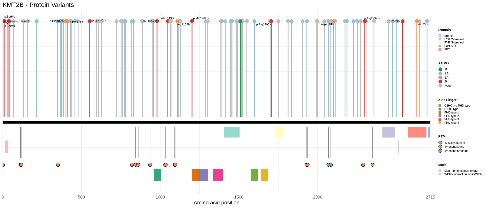
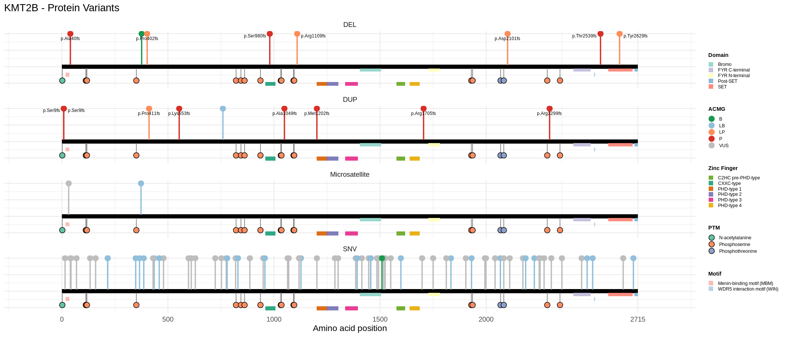
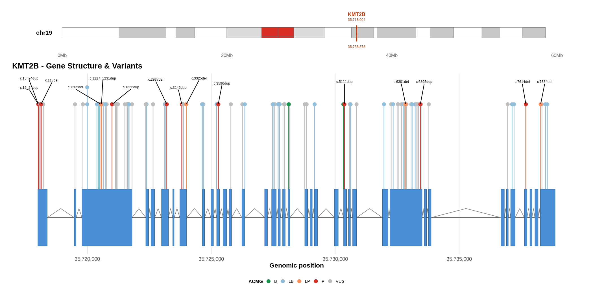
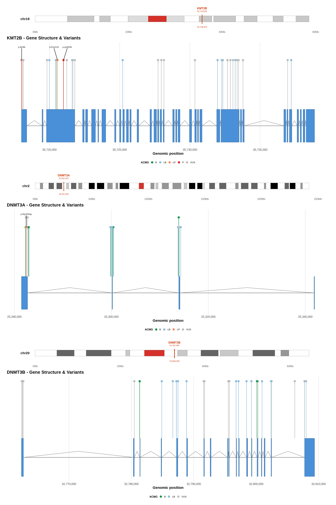

# VizMut-lolliplot

A command-line pipeline for visualizing protein and genomic variants as lolliplots. Supports single-gene and multi-gene visualization with automatic retrieval of genomic structure from NCBI and cytogenetic bands from UCSC.

---

## Features

- **Protein lolliplot** — variants mapped to protein sequence with functional domains, motifs, PTMs and zinc fingers
- **Gene structure lolliplot** — variants mapped to genomic coordinates with exon/intron structure and chromosomal ideogram
- **Multi-gene lolliplot** — stack multiple genes in a single figure, each with its own ideogram and genomic structure
- **Automatic transcript retrieval** — fetches canonical RefSeq transcript from NCBI by gene symbol
- **ACMG classification** — real classification fetched from ClinVar via ClinicalTables API
- **Liftover support** — automatic hg19 → hg38 coordinate conversion via rtracklayer
- **Flexible gene list** — pass `all`, a comma-separated list, or a `.txt` file

---

## Installation

### Requirements

- R >= 4.1.0

```r
# CRAN
install.packages(c(
  'optparse', 'dplyr', 'stringr', 'ggplot2', 'ggrepel',
  'RColorBrewer', 'ggnewscale', 'httr', 'jsonlite',
  'xml2', 'R.utils', 'scales', 'patchwork'
))

# Bioconductor
BiocManager::install(c('rtracklayer', 'GenomicRanges'))
```

---

## Input files

### Variant file (`--variants`)

CSV with the following required columns:

| Column | Description | Example |
|--------|-------------|---------|
| `variant_id` | Unique variant identifier | `cv_1` |
| `gen_position` | Genomic position | `chr19-35718020 N>N` |
| `protein_change` | Protein change in HGVS | `p.Lys376del` |
| `hgvs_c` | CDS change in HGVS | `NM_014727.3:c.1126del` |
| `variant_type` | Variant type | `SNV`, `DEL`, `DUP`, `INS` |
| `ACMG` | ACMG classification | `P`, `LP`, `VUS`, `LB`, `B` |

For `--plot_type multi_gene`, an additional column is required:

| Column | Description | Example |
|--------|-------------|---------|
| `gene` | Gene symbol | `KMT2B` |

### Features file (`--features`)

Required only for `--plot_type protein`. CSV with the following columns:

| Column | Description | Example |
|--------|-------------|---------|
| `feature_type` | Type of feature | `domain`, `motif`, `ptm`, `Zinc finger` |
| `feature_name` | Feature name | `SET`, `Bromo` |
| `start` | Start position (aa) | `2516` |
| `end` | End position (aa) | `2668` |

---

## Usage

### Automatic enrichment from minimal CSV data

If you only have the `c.` identifier (e.g., gen:c.999A>C) for your variants, the pipeline can automatically enrich them by querying ClinVar and NCBI:

```csv
variant_id,hgvs_c
cv_1,KMT2B:c.252G>A
cv_2,KMT2B:c.1126_1128del
cv_3,KMT2B:c.898G>A
```

```bash
Rscript main.R \
  --variants data/variants_minimal.csv \
  --plot_type single_gene \
  --gene_name KMT2B \
  --transcript_id NM_014727.3 \
  --enrich TRUE \
  --enrich_output output/variants_enriched.csv \
  --output output/lolliplot_gene.png
```

Using this option, you can automatically obtain:
- Genomic coordinates in GRCh38
- ACMG classification from ClinVar
- Protein notation `p.`
- rsID from dbSNP
- Associated phenotype

Variants not found in ClinVar are plotted with `ACMG=NA` and the `c.` label, with their coordinates obtained from NCBI Variation Services.

### Protein lolliplot

```bash
Rscript main.R \
  --variants data/variant_kmt2b_toy.csv \
  --features data/features_kmt2b_toy.csv \
  --plot_type protein \
  --gene_name KMT2B \
  --protein_length 2715 \
  --grid FALSE \
  --output output/lolliplot_protein.png
```



---

### Protein lolliplot with grid (`--grid TRUE`)

Split the plot by variant type for a clearer view of each category.

```bash
Rscript main.R \
  --variants data/variant_kmt2b_toy.csv \
  --features data/features_kmt2b_toy.csv \
  --plot_type protein \
  --gene_name KMT2B \
  --protein_length 2715 \
  --grid TRUE \
  --output output/lolliplot_protein_grid.png
```



---

### Single gene lolliplot

Variants mapped to genomic coordinates with exon/intron structure and chromosomal ideogram. Transcript structure is automatically retrieved from NCBI.

```bash
Rscript main.R \
  --variants data/variant_kmt2b_toy.csv \
  --plot_type single_gene \
  --gene_name KMT2B \
  --transcript_id NM_014727.3 \
  --genome hg38 \
  --output output/lolliplot_gene.png
```



---

### Multi-gene lolliplot

Plot multiple genes in a single figure. Each gene gets its own ideogram and genomic structure. The canonical transcript is automatically retrieved from NCBI for each gene.

```bash
# All genes in the CSV
Rscript main.R \
  --variants data/variants_multigene_toy.csv \
  --plot_type multi_gene \
  --gene_list all \
  --genome hg38 \
  --output output/lolliplot_multigene.png

# Specific genes (inline)
Rscript main.R \
  --variants data/variants_multigene_toy.csv \
  --plot_type multi_gene \
  --gene_list "KMT2B,DNMT3A" \
  --genome hg38 \
  --output output/lolliplot_multigene.png

# Specific genes (from file)
Rscript main.R \
  --variants data/variants_multigene_toy.csv \
  --plot_type multi_gene \
  --gene_list data/genes.txt \
  --genome hg38 \
  --output output/lolliplot_multigene.png
```



---

## All flags

| Flag | Description | Default |
|------|-------------|---------|
| `--variants` | Path to variant CSV | required |
| `--features` | Path to features CSV | required for `protein` |
| `--plot_type` | Plot type: `protein`, `single_gene`, `multi_gene` | `protein` |
| `--gene_name` | Gene name for plot title | `GENE` |
| `--protein_length` | Protein length in aa | required for `protein` |
| `--transcript_id` | RefSeq transcript ID | required for `single_gene` |
| `--gene_list` | Genes to plot: `all`, comma list, or `.txt` file | `all` |
| `--genome` | Genome assembly: `hg38` or `hg19` | `hg38` |
| `--grid` | Split plot by variant type: `TRUE` or `FALSE` | `FALSE` |
| `--label_type` | Variant label: `protein` or `cds` | `protein` |
| `--output` | Output path | `output/lolliplot.png` |
| `--enrich` | Enriquecer variantes automáticamente desde ClinVar y NCBI: `TRUE` o `FALSE` | `FALSE` |
| `--enrich_output` | Ruta para guardar el CSV enriquecido (ej. `output/enriched.csv`) | `NULL` |


---

---

## Known limitations

- UTR regions are not yet displayed in gene structure plots — see [issue #1](../../issues/1)
- Features (domains, motifs, PTMs) must be provided manually via CSV — automatic retrieval from UniProt planned — see [issue #2](../../issues/2)
  

---

## License

MIT
