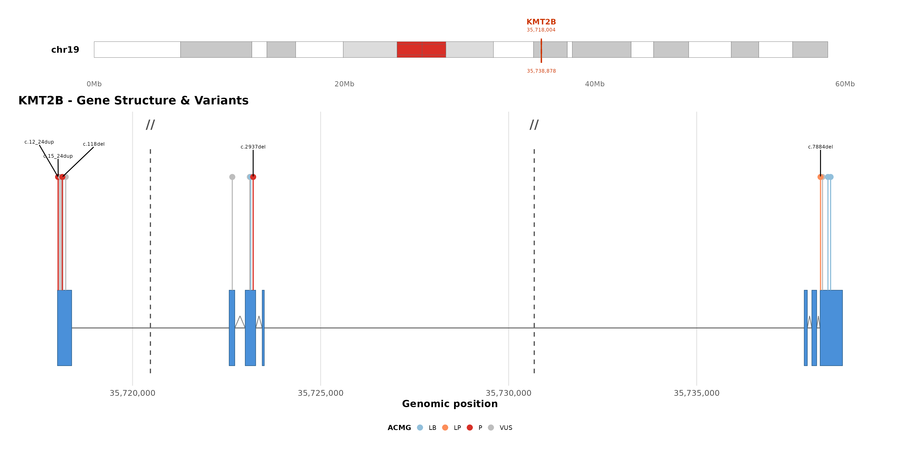

# VizMut-lolliplot

A command-line pipeline for visualizing protein and genomic variants as lolliplots. Supports single-gene and multi-gene visualization with automatic retrieval of genomic structure from NCBI and cytogenetic bands from UCSC.

---

## Features

- **Protein lolliplot** — variants mapped to protein sequence with functional domains, motifs, PTMs and zinc fingers
- **Gene structure lolliplot** — variants mapped to genomic coordinates with exon/intron structure and chromosomal ideogram
- **Multi-gene lolliplot** — stack multiple genes in a single figure, each with its own ideogram and genomic structure
- **Exon selection** — select specific exons to display using numbers or ranges (`--exons 1,5-7,10`)
- **Automatic transcript retrieval** — fetches canonical RefSeq transcript from NCBI by gene symbol
- **ACMG classification** — real classification fetched from ClinVar via ClinicalTables API
- **Liftover support** — automatic hg19 → hg38 coordinate conversion via rtracklayer
- **Enrichment mode** — minimal input (`GENE:c.XXXX`) auto-enriched with coordinates, ACMG and protein notation

---

## Installation

### Requirements

- R >= 4.1.0

```r
# CRAN
install.packages(c(
  'optparse', 'dplyr', 'stringr', 'ggplot2', 'ggrepel',
  'RColorBrewer', 'ggnewscale', 'httr', 'jsonlite',
  'xml2', 'R.utils', 'scales', 'patchwork'
))

# Bioconductor
BiocManager::install(c('rtracklayer', 'GenomicRanges'))
```

---

## Input files

### Variant file (`--variants`)

CSV with the following required columns:

| Column | Description | Example |
|--------|-------------|---------|
| `variant_id` | Unique variant identifier | `cv_1` |
| `gen_position` | Genomic position | `chr19-35718020 N>N` |
| `protein_change` | Protein change in HGVS | `p.Lys376del` |
| `hgvs_c` | CDS change in HGVS | `NM_014727.3:c.1126del` |
| `variant_type` | Variant type | `SNV`, `DEL`, `DUP`, `INS` |
| `ACMG` | ACMG classification | `P`, `LP`, `VUS`, `LB`, `B` |

For `--plot_type multi_gene`, an additional column is required:

| Column | Description | Example |
|--------|-------------|---------|
| `gene` | Gene symbol | `KMT2B` |

When using `--enrich TRUE`, the minimal input is:

| Column | Description | Example |
|--------|-------------|---------|
| `variant_id` | Unique variant identifier | `cv_1` |
| `hgvs_c` | CDS change with gene symbol | `KMT2B:c.252G>A` |

### Features file (`--features`)

Required only for `--plot_type protein`. CSV with the following columns:

| Column | Description | Example |
|--------|-------------|---------|
| `feature_type` | Type of feature | `domain`, `motif`, `ptm`, `Zinc finger` |
| `feature_name` | Feature name | `SET`, `Bromo` |
| `start` | Start position (aa) | `2516` |
| `end` | End position (aa) | `2668` |

---

## Usage


### Protein lolliplot

Variants are plotted as vertical lollipops above a horizontal protein backbone. Below the backbone, functional features are displayed in layers: domains (first layer), motifs (second), PTMs (third, as circles with anchor lines), and zinc fingers (fourth). Each variant is colored by its ACMG classification. Labels appear only for P and LP variants to avoid clutter.

```bash
Rscript main.R \
  --variants data/variant_kmt2b_toy.csv \
  --features data/features_kmt2b_toy.csv \
  --plot_type protein \
  --gene_name KMT2B \
  --protein_length 2715 \
  --grid FALSE \
  --output output/lolliplot_protein.png
```


---

### Protein lolliplot with grid (`--grid TRUE`)

When `--grid TRUE` is set, the plot is split into separate panels by variant type (SNV, DEL, DUP, etc.), each with its own Y scale. This is useful for datasets with many variant types to avoid visual overlap.

```bash
Rscript main.R \
  --variants data/variant_kmt2b_toy.csv \
  --features data/features_kmt2b_toy.csv \
  --plot_type protein \
  --gene_name KMT2B \
  --protein_length 2715 \
  --grid TRUE \
  --output output/lolliplot_protein_grid.png
```


---

### Single gene lolliplot

Variants are plotted over the actual genomic structure of the transcript — exons as blue rectangles, introns as chevron lines. A chromosomal ideogram with Giemsa bands is shown at the top, with the gene position highlighted in red. Variant labels use `c.` notation by default. The transcript structure is automatically retrieved from NCBI using the provided RefSeq ID.

```bash
Rscript main.R \
  --variants data/variant_kmt2b_toy.csv \
  --plot_type single_gene \
  --gene_name KMT2B \
  --transcript_id NM_014727.3 \
  --genome hg38 \
  --output output/lolliplot_gene.png
```


---

### Single gene lolliplot with exon selection (`--exons`)

When `--exons` is specified, only the selected exons are displayed. Non-consecutive exon groups are separated by `//` break markers. Introns are shown only between consecutive selected exons. Only variants within the selected regions are plotted; all others are excluded with a log message.

```bash
Rscript main.R \
  --variants data/variant_kmt2b_toy.csv \
  --plot_type single_gene \
  --gene_name KMT2B \
  --transcript_id NM_014727.3 \
  --exons 1,5-7,35-37 \
  --output output/lolliplot_exons.png
```



---

### Multi-gene lolliplot

Each gene is plotted in its own panel stacked vertically. Each panel includes its chromosomal ideogram and genomic structure. The canonical transcript is automatically retrieved from NCBI for each gene. The gene list can be passed as `all`, a comma-separated string, or a `.txt` file with one gene per line.

```bash
# All genes in the CSV
Rscript main.R \
  --variants data/variants_multigene_toy.csv \
  --plot_type multi_gene \
  --gene_list all \
  --genome hg38 \
  --output output/lolliplot_multigene.png

# Specific genes (inline)
Rscript main.R \
  --variants data/variants_multigene_toy.csv \
  --plot_type multi_gene \
  --gene_list "KMT2B,DNMT3A" \
  --genome hg38 \
  --output output/lolliplot_multigene.png

# Specific genes (from file)
Rscript main.R \
  --variants data/variants_multigene_toy.csv \
  --plot_type multi_gene \
  --gene_list data/genes.txt \
  --genome hg38 \
  --output output/lolliplot_multigene.png
```


---

### Enrichment mode (`--enrich TRUE`)

When `--enrich TRUE` is set, the pipeline accepts a minimal CSV with only `variant_id` and `hgvs_c` in `GENE:c.XXXX` format. It automatically retrieves coordinates, ACMG classification, protein notation, rsID and phenotype from ClinVar. Variants not found in ClinVar are plotted with `ACMG=NA` using their `c.` label, with coordinates obtained from NCBI Variation Services when available.

```bash
Rscript main.R \
  --variants data/variants_minimal.csv \
  --plot_type single_gene \
  --gene_name KMT2B \
  --transcript_id NM_014727.3 \
  --enrich TRUE \
  --enrich_output output/variants_enriched.csv \
  --output output/lolliplot_gene.png
```

#### Enrichment output columns

| Column | Description | Source |
|--------|-------------|--------|
| `variant_id` | Original user ID | Input |
| `gene` | Gene symbol | Extracted from `hgvs_c` |
| `hgvs_c` | Original CDS notation | Input |
| `protein_change` | Protein notation (`p.`) | ClinVar |
| `chr` | Chromosome (hg38) | ClinVar + liftover |
| `pos` | Genomic position (hg38) | ClinVar + liftover |
| `ref` | Reference allele | ClinVar |
| `alt` | Alternate allele | ClinVar |
| `variant_type` | Variant type | ClinVar |
| `ACMG` | ACMG classification | ClinVar (`NA` if not found) |
| `clinsig` | Full clinical significance | ClinVar |
| `phenotype` | Associated phenotype | ClinVar |
| `dbsnp` | rsID | ClinVar / NCBI Variation Services |
| `gen_position` | Formatted genomic position | Computed |

Example enrichment output:

| variant_id | gene | hgvs_c | protein_change | ACMG | clinsig | phenotype |
|-----------|------|--------|----------------|------|---------|-----------|
| cv_1 | KMT2B | KMT2B:c.252G>A | p.Trp84Ter | P | Pathogenic | Complex neurodevelopmental disorder |
| cv_2 | KMT2B | KMT2B:c.1126_1128del | p.Lys376del | B | Benign | Dystonia 28, childhood-onset |
| cv_3 | KMT2B | KMT2B:c.898G>A | NA | NA | Not in ClinVar | NA |

---

## ACMG color scheme

| Classification | Color | Description |
|---------------|-------|-------------|
| P | Red | Pathogenic |
| LP | Orange | Likely pathogenic |
| VUS | Gray | Variant of uncertain significance |
| LB | Light blue | Likely benign |
| B | Green | Benign |
| NA | Dark gray | Not found in ClinVar |

---

## All flags

| Flag | Description | Default |
|------|-------------|---------|
| `--variants` | Path to variant CSV | required |
| `--features` | Path to features CSV | required for `protein` |
| `--plot_type` | Plot type: `protein`, `single_gene`, `multi_gene` | `protein` |
| `--gene_name` | Gene name for plot title | `GENE` |
| `--protein_length` | Protein length in aa | required for `protein` |
| `--transcript_id` | RefSeq transcript ID (e.g. `NM_014727.3`) | required for `single_gene` |
| `--gene_list` | Genes to plot: `all`, comma list, or `.txt` file | `all` |
| `--genome` | Genome assembly: `hg38` or `hg19` | `hg38` |
| `--grid` | Split plot by variant type: `TRUE` or `FALSE` | `FALSE` |
| `--label_type` | Variant label: `protein` or `cds` | `protein` |
| `--exons` | Exons to display: numbers or ranges e.g. `1,5-7,10` | all exons |
| `--enrich` | Auto-enrich variants from ClinVar and NCBI: `TRUE` or `FALSE` | `FALSE` |
| `--enrich_output` | Path to save enriched CSV (e.g. `output/enriched.csv`) | `NULL` |
| `--output` | Output path | `output/lolliplot.png` |
---

## Known limitations

- UTR regions not yet displayed in gene structure plots — see [issue #1](../../issues/1)
- Features must be provided manually via CSV — automatic retrieval from UniProt planned — see [issue #2](../../issues/2)

---

## License

MIT
